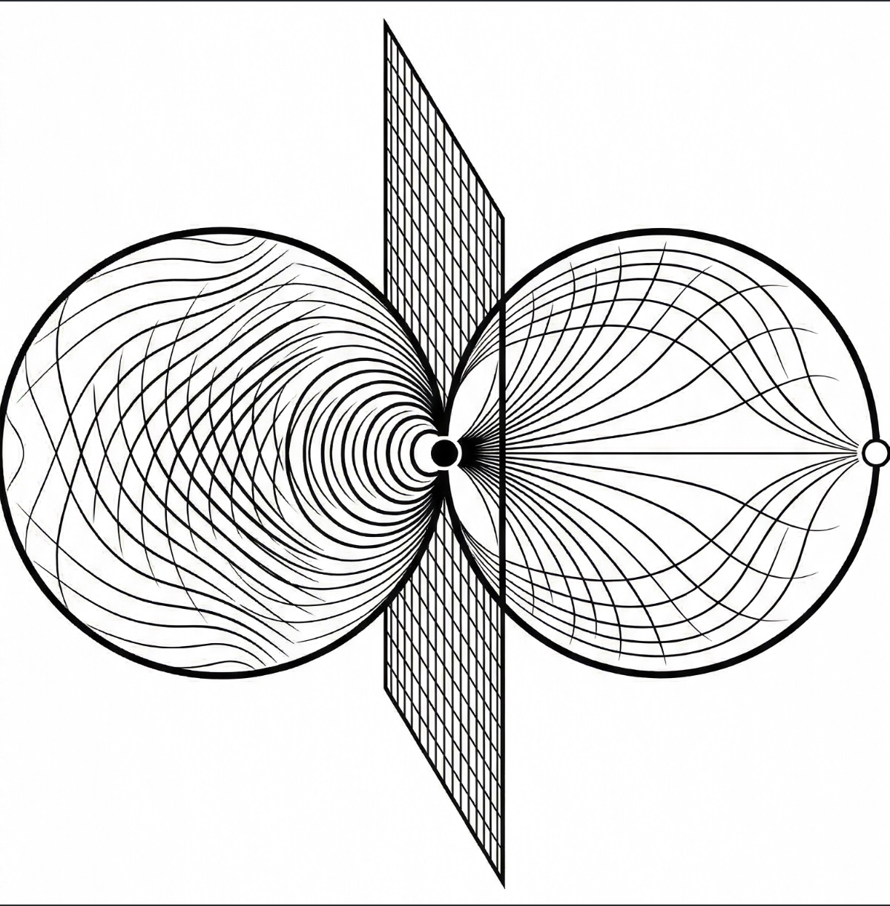

# Projective Process Monism

<p align="center">
  
  <br/><br/>
  <a href="https://projectiveprocessmonism.com">projectiveprocessmonism.com</a>
</p>

## A Topological Framework for Fundamental Constants, Gravity, and Consciousness

[](https://mybinder.org/v2/gh/woz5999/ppm-framework/HEAD)
[](https://github.com/woz5999/ppm-framework/actions/workflows/tests.yml)

---

## The problem

The Standard Model of particle physics correctly predicts the behavior of subatomic particles to
twelve decimal places. Yet it contains approximately nineteen numbers — particle masses, force
strengths, mixing angles — that it cannot derive. It measures them from experiment, writes them
down, and moves on. The theory is silent on why these numbers take the values they do.

Two deeper problems compound this. **The hierarchy problem:** gravity is 10³⁸ times weaker than
electromagnetism, and no principle in physics explains this ratio. **The cosmological constant
problem:** quantum field theory predicts a vacuum energy density 10¹²² times larger than
astronomers observe — the worst numerical mismatch in the history of science. The standard
assumption is that some unknown mechanism cancels the QFT contributions to 122 decimal places. No
such mechanism has been found.

These are not gaps at the edges of knowledge. They are holes at its center.

---

## Two notebooks: two ways to test the framework

This repository is the computational companion to
[projectiveprocessmonism.com](https://projectiveprocessmonism.com). The theory and full
derivations live there. What lives here are two notebooks that let you interrogate the framework
directly — one focused on what it predicts, one focused on whether those predictions could be
accidental.

### `first_principles_predictions.ipynb` — Does PPM actually predict anything?

The sharpest test of any framework is whether it produces correct numbers *before* you look at
the measurements. This notebook isolates five quantities that PPM derives from geometry alone,
with no experimental input beyond the pion mass:

| Prediction     | Geometric input                 | Formula                 | Predicted     | Observed             |
| -------------- | ------------------------------- | ----------------------- | ------------- | -------------------- |
| CKM δ_CP       | 720° Berry phase on RP³         | π(1 − 1/φ)              | 1.200 rad     | 1.20 ± 0.08 rad      |
| sin²θ₂₃        | Z₂ × 3D topology (tribimaximal) | 1/2 (exact)             | 0.500         | 0.546 ± 0.021        |
| H₀             | T_universe from CMB             | 1/T_universe            | 70.9 km/s/Mpc | 69.8 ± 1.9 (TRGB)    |
| α_w            | RP³ = S³/Z₂ volume ratio        | 1/(3π²)                 | 1/29.6        | 1/29.9 ± 0.2         |
| G(t) evolution | N_cosmic ∝ causal volume        | G/G₀ = (1+z)^{3/2} band | 5–36× at z=10 | 3–100× (JWST excess) |

The CP-violation phase is exact to measurement precision; the atmospheric mixing angle prediction (0.500 vs observed 0.546) has 8.4% error, consistent with a leading-order geometric approximation — values
the Standard Model treats as unexplained inputs. The Hubble constant prediction addresses the
current tension between early- and late-universe measurements directly: the framework derives
H₀ = 1/T_universe from the CMB age, landing between the two conflicting methods. The G(t) section
maps PPM's prediction that gravity was stronger in the early universe against the James Webb Space
Telescope's discovery of anomalously massive galaxies at z = 7–16 — structures too large to have
formed under ΛCDM's fixed-G assumption — and shows the predicted G enhancement band brackets the
observed 3–100× excess.

Each prediction is derived, visualized, and compared to measurement in the notebook. Each is also
independently tested in `tests/test_all.py`.

[**→ Run in browser (no install)**](https://ppm-framework.fly.dev/voila/render/first_principles_predictions.ipynb)

### `constraint_sensitivity.ipynb` — Are the parameters fitted or forced?

A framework that predicts correctly could still be suspicious if its parameters were tuned after
the fact. This notebook addresses that question directly. It presents seven coupled observables —
from the particle mass spectrum through electroweak symmetry breaking to Newton's constant and
body temperature — and lets you move the underlying parameters with interactive sliders.

| Section | Topic                                | Mystery addressed                          |
| ------- | ------------------------------------ | ------------------------------------------ |
| 1       | Full particle spectrum               | Why do masses span 30 orders of magnitude? |
| 2       | `g = 2π` from topology               | What fixes the energy level spacing?       |
| 3       | `k_EWSB = 44.5` from RP³             | What determines the Higgs mass scale?      |
| 4       | Λ_obs → N → α consistency prediction | Why is α = 1/137?                          |
| 5       | `N_cosmic = 10⁸²`, G, Λ, H₀          | Why is gravity weak? Why is Λ small?       |
| 6       | Phase coherence crossing             | What connects quantum scales to biology?   |
| 7       | Consciousness critical point         | Why does biology operate at 310 K?         |

When you move a parameter away from its geometrically predicted value, multiple independent
observables degrade simultaneously — particle masses, force constants, and biological temperature
all break together. The parameters are not individually fitted to any one observable. Only one
value of each satisfies all constraints at once, and that value is determined by the geometry
before any measurement enters.

[**→ Run in browser (no install)**](https://ppm-framework.fly.dev/voila/render/constraint_sensitivity.ipynb)

---

## How the framework works

**Projective Process Monism (PPM)** proposes that physical reality has a discrete, hierarchical
structure. Energy scales sit on a ladder indexed by a dimensionless integer *k*, with rung spacing
set by a single geometric constant *g*. The ladder is anchored at one measured scale: the pion
mass.

```
E(k) = m_π × g^((k_ref − k) / 2)
```

where `m_π = 140 MeV` is the experimental anchor, `k_ref = 51` is the confinement level, and
`g = 2π` is derived from topology. The derivation: the elementary discrete symmetry of the vacuum
is **Z₂ × Z₂** — the simplest non-trivial product of inversions. The natural geometric arena for
a Z₂ × Z₂-invariant process in 3+1 dimensions is the real projective space **RP³ ≅ SO(3)**, with
volume π² in the natural SU(2) metric:

```
g² = |Z₂ × Z₂| × Vol(RP³) = 4 × π² = 4π²   →   g = 2π
```

No particle mass enters this calculation. That single formula — one measured input, step size from
geometry — predicts particle masses across 30 orders of magnitude, and the same constant fixes
the strength of electromagnetism, the weakness of gravity, the cosmological constant, and the
temperature at which biological processes are possible.

### The logical chain

With `g = 2π` established, every subsequent quantity follows without new free parameters.

**Particle spectrum.** `E(k)` spans from the Planck scale (`k ≈ 0`) to the thermal energy of a
living cell. Every major Standard Model particle has a k-assignment that reproduces its mass.
Particles with topology-derived prefactors sit above the bare curve: the Higgs VEV
`v = 2√2(2π)^(1/4) × E(44.5) = 246.2 GeV` (observed: 246.2 GeV) and the top quark
`m_t = π × E(44.5) = 172.7 GeV` (observed: 173.0 GeV). The prefactors come from SU(2) → U(1)
geometry, not fitting.

**Electroweak sector.** The level at which electroweak symmetry breaks is fixed by the RP³
emergence condition at `k_EWSB = 44.5`. The lepton mass hierarchy — spanning six orders of
magnitude with no Standard Model explanation — emerges as a Z₂-quantized tower above this level.

**Fine structure constant.** The framework's formulas for G and Λ both contain α. The observed Λ fixes N (no free parameters); then the observed G and N determine α:

```
α = G_obs · m_π² · √N / (16π⁴ ħc) = 1/(137.6 ± 1.3)
```

Central error 0.4%; the observed value 1/137.036 lies within the 1σ band from Λ_obs uncertainty. This is a consistency prediction using zero free parameters.

**Newton's constant and the cosmological constant.** Both follow from the same holographic count
with different exponents:

```
G = 16π⁴ ħc α / (m_π² √N_cosmic)    →    G ∝ N^(−1/2)
Λ = 2(m_π c²)² / ((ħc)² N_cosmic)   →    Λ ∝ N^(−1)
```

Because the exponents differ, only one value of `N_cosmic` satisfies both simultaneously. That
value is `N ≈ 10⁸²`. Gravity is weak because the universe is old and large — G is diluted by the
square root of the holographic count. The cosmological constant is small because Λ falls faster.
Neither requires fine-tuning; both are consequences of the universe's age.

**Phase coherence and body temperature.** At each rung k, two phase contributions compete —
thermal phase (large at high energy, decreasing) and Berry phase (small at low energy,
increasing). They cross at exactly one point. At `n = 5/6` — the crossing falls at `k_cross ≈ 75.354`, corresponding to `T = 310 K`. Human body
temperature is not a separate prediction. It is an automatic consequence of the value of n
established by electromagnetism.

---

## Key predictions at a glance

All predictions use `g = 2π` (topology) and `m_π = 140 MeV` (one experimental anchor).
No other free parameters.

| Observable | Formula                               | Prediction     | Observed        | Error    |
| ---------- | ------------------------------------- | -------------- | --------------- | -------- |
| Higgs VEV  | `2√2(2π)^(1/4) × E(44.5)`             | 246.2 GeV      | 246.2 GeV       | < 0.01%  |
| Top quark  | `π × E(44.5)`                         | 172.7 GeV      | 173.0 GeV       | 0.2%     |
| `α⁻¹`      | Consistency: Λ_obs → N → α            | 137.6 ± 1.3    | 137.036         | 0.4%     |
| `G`        | `16π⁴ħcα / (m_π² √N)`                 | ~6.5×10⁻¹¹     | 6.674×10⁻¹¹     | ~4%      |
| `Λ`        | `2m_π² / ((ħc)² N)`                   | ~1.0×10⁻⁵² m⁻² | ~1.1×10⁻⁵² m⁻²  | ~9%      |
| `T_bio`    | Phase coherence crossing at `n = 5/6` | 310 K          | 310 K           | exact    |
| `α_w`      | `1/(3π²)` from RP³ geometry           | `1/29.6`       | `1/29.9`        | ~1%      |
| `α_s`      | Confinement condition at `k = 51`     | `1/3`          | `1/3`           | exact    |
| `δ_CP`     | Berry phase: `π(1 − 1/φ)`             | 1.200 rad      | 1.20 ± 0.08 rad | 0.0%     |
| `sin²θ₂₃`  | Tribimaximal from Z₂ × 3D topology    | `1/2` (exact)  | 0.546 ± 0.021   | 8.4%     |
| `H₀`       | `1/T_universe` (CMB age: 13.797 Gyr)  | 70.9 km/s/Mpc  | 69.8 (TRGB)     | ~1.5%    |
| `G(t)/G₀`  | `N_cosmic ∝ (1+z)^{-3}` causal volume | 5–36× at z=10  | 3–100× (JWST)   | overlaps |

---

## What "zero free parameters" means

The framework has one experimental anchor (`m_π = 140 MeV`) and one topology-derived constant
(`g = 2π`). Every other quantity follows by calculation — and the sequence closes on itself:

```
  topology: Z₂ × Z₂
        │  Vol(RP³) = π²
        ▼
     g = 2π  ◄─────────────────────────────────────────────────────┐
        │                                                           │
        │  E(k) = m_π · g^((51−k)/2)                               │
        │                                                           │
   ┌────┴──────────────────┐                                        │
   ▼                       ▼                                        │
k = 44.5               k = 51                                       │
EW sector              anchor: m_π = 140 MeV                        │
Higgs, top, τ, μ, e                                                 │
   │                                                                │
   ▼                                                                │
n = 5/6  (CP³ phase space: 5 of 6 dims projected by Z₂)            │
   │                                                                │
   ▼                                                                │
Λ_obs → N_cosmic = 10⁸²                                            │
   │                                                                │
   ├──►  G,  Λ,  H₀                                                 │
   ├──►  α = 1/(137.6 ± 1.3)  (consistency prediction from G, N)   │
   │                                                                │
   ▼                                                                │
T_bio = 310 K                                                       │
   │                                                                │
   └──  k_c ≈ 75.4  ·  E(k_c) = k_B × 310 K  ·  on E(k) above ───┘
```

Topology fixes `g`. Geometry fixes `k_EWSB` and `n`. Holography fixes `N_cosmic`. The consistency
of G and Λ with framework geometry determines `α`. Phase coherence fixes `T_bio`. No step adjusts
a previous result to fit a new observation. The endpoint — 310 K —
lands back on the same `E(k)` ladder the chain began with.

---

## Repository structure

```
ppm-framework/
├── ppm/                        # Core computational package
│   ├── constants.py            # Physical and framework constants
│   ├── hierarchy.py            # E(k) hierarchy formula
│   ├── constraint_solver.py    # 8-equation coupled constraint system
│   ├── phase_coherence.py      # Phase coherence condition and critical point
│   ├── cosmology.py            # G, Λ, H₀ from N_cosmic
│   ├── predictions.py          # Independent prediction evaluation
│   ├── berry_phase.py          # Berry phase accumulation
│   └── twistor.py              # Twistor/CP³ geometry
│
├── notebooks/
│   ├── first_principles_predictions.ipynb  # Five parameter-free predictions
│   └── constraint_sensitivity.ipynb        # Interactive constraint demonstrations
│
└── tests/
    └── test_all.py
```

---

## Installation

```bash
pip install -e .
```

**Requirements:** Python 3.9+, NumPy, Matplotlib, ipywidgets, Jupyter.

```bash
jupyter notebook notebooks/first_principles_predictions.ipynb
jupyter notebook notebooks/constraint_sensitivity.ipynb
```

Or launch either notebook directly in your browser (no installation required):
[first_principles_predictions.ipynb](https://ppm-framework.fly.dev/voila/render/first_principles_predictions.ipynb) · [constraint_sensitivity.ipynb](https://ppm-framework.fly.dev/voila/render/constraint_sensitivity.ipynb)

---

## Running tests

```bash
pytest tests/test_all.py -v
```

---

## Citation

```bibtex
@article{ppm-framework-2026,
  title   = {Projective Process Monism: Deriving Physical Constants
             from Z2 x Z2 -> RP3 Topology},
  author  = {Jeff Wozniak},
  year    = {2026},
  url     = {https://projectiveprocessmonism.com}
}
```

---

## Run locally (Docker)

```bash
bash dev/run.sh
```

Starts two servers — no Python environment setup required:

- **Jupyter Lab** (code visible): `http://localhost:8888`
- **Voilà** (rendered app, code hidden): `http://localhost:8889`

Custom ports: `bash dev/run.sh ppm 8888 8889`. `dev/` contains `Dockerfile`, `requirements-dev.txt`, and `start.sh` if you prefer to build manually.

---

## License

MIT
