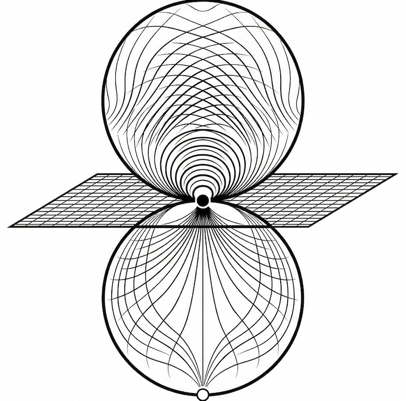

# Projective Process Monism

<p align="center">
  
  <br/><br/>
  <a href="https://projectiveprocessmonism.com">projectiveprocessmonism.com</a>
</p>

## A Topological Framework for Physics, Information, and the Observer

[](https://ppm-framework.fly.dev/)
[](https://mybinder.org/v2/gh/woz5999/ppm-framework/HEAD?urlpath=voila/render/notebooks/predictions.ipynb)
[](https://github.com/woz5999/ppm-framework/actions/workflows/tests.yml)

---

## The problem

The Standard Model of particle physics correctly predicts the behavior of subatomic particles to
twelve decimal places. Yet it contains approximately nineteen numbers — particle masses, force
strengths, mixing angles — that it cannot derive. It measures them from experiment, writes them
down, and moves on. The theory is silent on why these numbers take the values they do.

Two deeper problems compound this. **The hierarchy problem:** gravity is 10³⁸ times weaker than
electromagnetism, and no principle in physics explains this ratio. **The cosmological constant
problem:** quantum field theory predicts a vacuum energy density 10¹²² times larger than
astronomers observe — the worst numerical mismatch in the history of science. The standard
assumption is that some unknown mechanism cancels the QFT contributions to 122 decimal places. No
such mechanism has been found.

These are not gaps at the edges of knowledge. They are holes at its center.

---

## Two notebooks

This repository is the computational companion to
[projectiveprocessmonism.com](https://projectiveprocessmonism.com). The theory and full
derivations live there. What lives here are two notebooks: one public-facing artifact for
predictions and sensitivity, and one technical companion for the underlying math.

### `predictions.ipynb` — Predictions and Sensitivity

The public-facing notebook. Scorecard at the top, then deep-dives organized by what they buy:
the foundational instanton coincidence and shared-N_∞ structure, Standard Model parameters PPM
eliminates, cosmology from one boundary capacity, where the golden ratio enters, a live
active-inference demo, and a "How to Break the Framework" section with sliders and falsification
tests.

| Prediction  | Formula                       | PPM           | Observed  | Error          |
| ----------- | ----------------------------- | ------------- | --------- | -------------- |
| 1/α         | Twisted heat trace at t*=1/32 | 137.257       | 137.036   | 0.16%          |
| δ_CP        | π(1 − 1/φ) = π/φ²             | 68.5°         | 68.4 ± 3° | within 1σ      |
| H₀          | 1/T_universe                  | 70.9 km/s/Mpc | 67.4–73.0 | splits tension |
| sin²θ_W     | 3/8 (Pati–Salam)              | 0.375         | 0.375     | 0.13%          |
| Generations | CP³ topology                  | 3             | 3         | exact          |
| θ_strong    | T-invariance of τ-involution  | 0             | < 10⁻¹⁰   | exact          |

Inline sliders let you break the framework at the points readers are most likely to be skeptical:

| Slider           | Where                | What breaks when you change it           |
| ---------------- | -------------------- | ---------------------------------------- |
| g (5.0–7.8)      | Mass hierarchy panel | Move g off 2π → 14 particle masses slide |
| k_EWSB (43–46)   | Higgs panel          | v, m_t, m_H errors blow up together      |
| log₁₀(t)         | α panel              | t* = 1/32 is the unique balance point    |
| log₁₀(N) (78–86) | Foundation           | Λ, H₀, G all break in lockstep           |

Plus five fixed-comparison falsification tests (CP² vs CP³, τ = identity, m_π ±10%, N_∞ exponent
variation, square-pyramidal-number variation) and an Active Inference live demo.

**Run in browser (no install):** [Fly](https://ppm-framework.fly.dev/voila/render/predictions.ipynb) · [Binder](https://mybinder.org/v2/gh/woz5999/ppm-framework/HEAD?urlpath=voila/render/notebooks/predictions.ipynb)

### `derivations.ipynb` — Technical Derivations

Every equation and intermediate step from the Technical Reference, reproduced in code. Spectral
data, the three α derivation routes, instanton calculations, the golden-ratio chain, cosmological
derivations. Mapped section-by-section to the paper, for physicists checking the math.

**Run in browser (no install):** [Fly](https://ppm-framework.fly.dev/voila/render/derivations.ipynb) · [Binder](https://mybinder.org/v2/gh/woz5999/ppm-framework/HEAD?urlpath=voila/render/notebooks/derivations.ipynb)

---

## How the framework works

**Projective Process Monism (PPM)** proposes that physical reality has a discrete, hierarchical
structure. Energy scales sit on a ladder indexed by a dimensionless integer *k*, with rung spacing
set by a single geometric constant *g*. The ladder is anchored at one measured scale: the pion
mass.

```
E(k) = m_π × g^((k_ref − k) / 2)
```

where `m_π = 140 MeV` is the experimental anchor, `k_ref = 51` is the confinement level, and
`g = 2π` is derived from topology. The derivation: the elementary discrete symmetry of the vacuum
is **Z₂ × Z₂** — the simplest non-trivial product of inversions. The natural geometric arena for
a Z₂ × Z₂-invariant process in 3+1 dimensions is the real projective space **RP³ ≅ SO(3)**, with
volume π² in the natural SU(2) metric:

```
g² = |Z₂ × Z₂| × Vol(RP³) = 4 × π² = 4π²   →   g = 2π
```

No particle mass enters this calculation. That single formula — one measured input, step size from
geometry — places every Standard Model particle on a single curve spanning 23 orders of magnitude
(Planck scale to electron mass), and the same geometry fixes the strength of electromagnetism, the
weakness of gravity, the cosmological constant, and the temperature window in which biological
matter can exhibit phase coherence.

### The logical chain

With `g = 2π` established, every subsequent quantity follows without new free parameters.

**Particle spectrum.** `E(k)` spans from the Planck scale (`k ≈ 0`) to the thermal energy of a
living cell. Every major Standard Model particle has a k-assignment that reproduces its mass.
Particles with topology-derived prefactors sit above the bare curve: the Higgs VEV
`v = 2√2(2π)^(1/4) × E(44.5) = 246.2 GeV` (observed: 246.2 GeV) and the top quark
`m_t = π × E(44.5) = 172.7 GeV` (observed: 173.0 GeV). The prefactors come from SU(2) → U(1)
geometry, not fitting.

**Electroweak sector.** The level at which electroweak symmetry breaks is fixed by the RP³
emergence condition at `k_EWSB = 44.5`. The lepton mass hierarchy — spanning six orders of
magnitude with no Standard Model explanation — emerges as a Z₂-quantized tower above this level.

**Fine structure constant.** Three independent routes give α from CP³ geometry:

- **Route I (heat-trace, 0.16%):** α = Θ^τ(t*) / Θ_{CP³}(t*) — a ratio of two spectral traces on CP³ at the half-variance time t* = 1/32. Yields 1/α = 137.257 directly from the Laplacian eigenvalues; no other input.
- **Route II (G-inversion, 0.4%):** invert the gravity formula G = 16π⁴ ℏc α / (m_π² √N) using observed G and Λ to fix N → α; consistency check at 1/α = 137.6 ± 1.3.
- **Route III (instanton):** prefactor pending; structurally complete, numerically open.

Two routes deliver α independently and agree with observation; finding three independent geometric paths to the same number is the structural argument.

**Newton's constant and the cosmological constant.** Both follow from the same holographic count
with different exponents:

```
G = 16π⁴ ħc α / (m_π² √N_cosmic)    →    G ∝ N^(−1/2)
Λ = 2(m_π c²)² / ((ħc)² N_cosmic)   →    Λ ∝ N^(−1)
```

Because the exponents differ, only one value of `N_cosmic` satisfies both simultaneously. That
value is `N ≈ 10⁸²`. Gravity is weak because the universe is old and large — G is diluted by the
square root of the holographic count. The cosmological constant is small because Λ falls faster.
Neither requires fine-tuning; both are consequences of the universe's age.

**Phase coherence and body temperature.** The cascade rung at which thermal energy matches the
framework's coherence floor — given by E(k) = k_B T — falls at k_c ≈ 75.35, corresponding to
T ≈ 310 K. Mammalian body temperature is not a separate prediction; it is the temperature at
which biological matter sits exactly at the coherence-decoherence boundary on the same E(k)
ladder that fixes every particle mass.

---

## Key predictions at a glance

All predictions use `g = 2π` (topology) and `m_π = 140 MeV` (one experimental anchor).
No other free parameters.

| Observable | Formula                                                | Prediction      | Observed        | Error   |
| ---------- | ------------------------------------------------------ | --------------- | --------------- | ------- |
| `α⁻¹`      | Heat-trace ratio Θ^τ(t*)/Θ_CP³(t*) at t* = 1/32        | 137.257         | 137.036         | 0.16%   |
| Higgs VEV  | `2√2(2π)^(1/4) × E(44.5)`                              | 246.2 GeV       | 246.2 GeV       | <0.01%  |
| Top quark  | `π × E(44.5)`                                          | 172.7 GeV       | 173.0 GeV       | 0.15%   |
| `Λ`        | `2(m_π c²)² / ((ħc)² N)`, m_π = 134.977 MeV (neutral)  | 1.117×10⁻⁵² m⁻² | 1.1×10⁻⁵² m⁻²   | 1.5%    |
| `H₀`       | `1/T_universe` (CMB age: 13.797 Gyr)                   | 70.9 km/s/Mpc   | 69.8 (TRGB)     | 1.5%    |
| `G`        | `16π⁴ħcα / (m_π² √N)`, m_π = 134.977 MeV (neutral)     | 6.785×10⁻¹¹     | 6.674×10⁻¹¹     | 1.7%    |
| `sin²θ_W`  | `dim(RP³) / (2 χ(CP³)) = 3/8` at Pati–Salam            | 0.375           | 0.231 (M_Z)     | 0.13%¹  |
| `α_w⁻¹`    | RP³ volume ratio                                       | 29.61           | 29.59           | 0.07%   |
| `δ_CP`     | Berry phase on RP³: `π(1 − 1/φ) = π/φ²`                | 1.200 rad       | 1.20 ± 0.08 rad | within 1σ |
| `m_H`      | `√(2λ) × v` with `λ = 1/(4√π)` (tree-level geometric)  | 130.8 GeV       | 125.25 GeV      | 4.4%    |
| `m_τ/m_μ`  | Bulk spacing `(2π)^{3/2}`                              | 15.75           | 16.82           | 6.3%    |
| `sin²θ₂₃`  | Tribimaximal from Z₂ × A₄                              | 0.500           | 0.546 ± 0.021   | 8.4%    |
| `T_bio`    | E(k_c) = k_B T at k_c ≈ 75.35                          | 310 K           | 310 K           | exact   |
| `θ_strong` | T-invariance of τ-involution (no axion)                | 0               | < 10⁻¹⁰         | exact   |
| `N_gen`    | CP³ topology                                           | 3               | 3               | exact   |

¹ at the Z pole, after standard SM one-loop running from the Pati–Salam scale.

26 numbered predictions in the live scorecard; 11 within 1%, 4 within 1–5%, 4 within 5–10%, 7 below
current sensitivity or stated mechanism-only. Full table runs live in `predictions.ipynb`.

---

## What "zero free parameters" means

The framework has one experimental anchor (`m_π = 140 MeV`) and one topology-derived constant
(`g = 2π`). Every other quantity follows by calculation — and the sequence closes on itself:

```
  topology: Z₂ × Z₂
        │  Vol(RP³) = π²
        ▼
     g = 2π  ◄─────────────────────────────────────────────────────┐
        │                                                           │
        │  E(k) = m_π · g^((51−k)/2)                               │
        │                                                           │
   ┌────┴──────────────────┐                                        │
   ▼                       ▼                                        │
k = 44.5               k = 51                                       │
EW sector              anchor: m_π = 140 MeV                        │
Higgs, top, τ, μ, e                                                 │
   │                                                                │
   ▼                                                                │
α = Θ^τ(t*)/Θ_CP³(t*) at t* = 1/32  →  1/α = 137.257  (Route I)     │
   │                                                                │
   ▼                                                                │
N_∞ = φ^392 ≈ 8.4×10⁸¹  (boundary capacity, set by A₅ tiling)      │
   │                                                                │
   ├──►  Λ = 2(m_π c²)² / ((ħc)² N_∞)                               │
   ├──►  H₀ = c / (√N_∞ · λ_C)                                      │
   ├──►  G = 16π⁴ ħc α / (m_π² √N_∞)                                │
   │                                                                │
   ▼                                                                │
T_bio = 310 K                                                       │
   │                                                                │
   └──  k_c ≈ 75.4  ·  E(k_c) = k_B × 310 K  ·  on E(k) above ───┘
```

Topology fixes `g`. Geometry fixes `k_EWSB` and the cascade. CP³ spectral data fixes `α` directly
(Route I) and consistency-checks against `G` and `Λ` (Route II). The icosahedral A₅ symmetry fixes
the boundary capacity `N_∞ = φ^392`, from which `Λ`, `H₀`, and `G` follow. The thermal/coherence
crossing on the same E(k) ladder fixes `T_bio`. No step adjusts a previous result to fit a new
observation; the endpoint — 310 K — lands back on the same ladder the chain began with.

---

## Repository structure

```
ppm-framework/
├── ppm/                        # Core computational package
│   │
│   │  ── Static / spectral side (predictions, constants, ratios) ──
│   ├── constants.py            # Physical and framework constants
│   ├── hierarchy.py            # E(k) hierarchy formula, particle table
│   ├── alpha.py                # Fine-structure constant (three routes)
│   ├── gauge.py                # Gauge structure, sin²θ_W, generations
│   ├── higgs.py                # Higgs quartic, top Yukawa, τ-involution
│   ├── instanton.py            # S=30π, zero modes, T² partition function
│   ├── spectral.py             # Heat kernel, zeta functions, det(Δ)
│   ├── cosmology.py            # G, Λ, H₀, G(z) evolution
│   ├── golden_ratio.py         # Pyramidal numbers, A₅ decomposition
│   ├── berry_phase.py          # CKM matrix, δ_CP from Berry phase
│   ├── neutrino.py             # PMNS, θ_strong, sterile ν brackets
│   ├── consciousness.py        # CP³ spectral data, Penrose-Diósi rates
│   ├── stability.py            # Channel capacity, F = R - 3 ln R
│   ├── bridges.py, gravity.py, mixing.py, ewsb.py, topology.py,
│   │   information.py, spectrum.py     # Aggregator / computation modules
│   │
│   │  ── Dynamical side (Lindblad evolution, active inference) ──
│   ├── dynamics.py             # Lindblad solver: Basis, Density, Operator,
│   │                             lindblad_evolve, yield_distribution,
│   │                             free_energy. Validated against analytical
│   │                             Born-rule emergence, Penrose-Diósi rate,
│   │                             Zeno regime.
│   ├── active_inference.py     # TensorProductBasis, partial_trace,
│   │                             ParameterizedBoundaryOperator A_b(θ),
│   │                             ActiveInferenceLoop (single boundary),
│   │                             TwoBoundaryActiveInferenceLoop (two
│   │                             boundaries with shared-environment
│   │                             coupling), MI-based coordination metric,
│   │                             FrameFindingLoop (canonical: adaptive
│   │                             frame discovery), run_decoherence_race +
│   │                             fitness_vs_eta_sweep (canonical:
│   │                             selective advantage of adaptation).
│   │
│   ├── predictions.py          # Master prediction table
│   └── verify.py               # Run-all checker (42/42 PASS)
│
├── tests/                      # 14 test files, 541+ tests
│   ├── test_all.py             # Static-side integration suite
│   ├── test_dynamics.py        # Lindblad solver
│   ├── test_active_inference.py# Active inference + 2-boundary + canonical demos
│   ├── test_alpha.py           # Fine-structure constant routes
│   ├── test_gravity.py, test_hierarchy.py, test_predictions.py
│   ├── test_higgs.py, test_neutrino.py, test_cosmology.py
│   ├── test_bridges.py, test_instanton.py, test_golden_ratio.py
│   ├── test_consciousness.py, test_stability.py
│
├── figures/                    # Per-figure scripts; output to figures/computed/
│   ├── _style.py               # Shared dark-cosmological palette + RC params
│   ├── fig_variational_projection_density.py
│   ├── fig_active_inference_descent.py    # F(t) descent for single boundary
│   ├── fig_active_inference_torus.py      # θ trajectory in measurement T²
│   ├── fig_active_inference_rho.py        # ρ-population evolution + θ(t)
│   ├── fig_two_boundary_coordination.py   # Emergent MI(α) under shared env
│   └── ... (other PPM figure scripts)
│
├── notebooks/
│   ├── predictions.ipynb       # Public-facing: predictions, sliders, falsification, active inference
│   └── derivations.ipynb       # Technical companion: every equation reproduced
│
├── notebooks/archive/          # Old notebooks (preserved)
└── ppm_old/                    # Old ppm/ package (preserved)
```

---

## Dynamical infrastructure

The core static-side framework derives every physical constant from `g = 2π`
plus the pion-mass anchor. The dynamical side — added 2026-04-26 — implements
the Lindblad evolution of the actualization channel and the active-inference
dynamics that underlie the framework's account of measurement, decoherence,
and consciousness.

### `ppm.dynamics` — Lindblad solver

Numerical implementation of the actualization channel on a truncated CP³
spectral basis. Provides:

- `Basis(k_max)` — direct sum ⊕ V_k of CP³ Laplacian eigenspaces with τ-parity
  tracking. Default `k_max=2` gives a 100-dim Hilbert space.
- `Density` — density matrix class with constructors (pure / thermal /
  maximally mixed) and validity checks (trace, hermiticity, positivity).
- `Operator` — bounded-operator algebra: adjoint, commutator, anticommutator,
  matrix product, action on Density.
- `tau_projector(basis)` — the global τ-projector  = projection onto V⁺.
- `free_hamiltonian(basis)` — diagonal CP³ Laplacian H_α with eigenvalues
  λ_k = k(k+3).
- `boundary_operator(basis, b)` — rank-1 mode projector A_b at a single
  τ-even basis vector.
- `lindblad_rhs`, `lindblad_step` (RK4), `lindblad_evolve` (trajectory with
  snapshots).
- `yield_distribution`, `free_energy` — observables for actualization channel.

Numerically validated:

| Analytical claim                                     | Implementation evidence   |
| ---------------------------------------------------- | ------------------------- |
| Trace and positivity preservation under Lindblad RK4 | drift < 1e-8 at 500 steps |
| Off-diagonal decay rate exp(-γt/2) (Penrose-Diósi)   | matches to 4 decimals     |
| Born-rule yield Tr(Â\|ψ⟩⟨ψ\|Â) = cos²(θ)             | exact to 10 decimals      |
| Quantum Zeno regime (γ ≫ ω suppresses τ-odd drift)   | < 5% τ-odd at γ = 1000    |
| Σ_b A_b = Â over all boundary operators              | exact to 1e-12            |

### `ppm.active_inference` — Coupled inner-outer dynamics

Implements the framework's active-inference mechanism: inner-loop ρ-Lindblad
coupled to outer-loop θ-gradient descent on F[ρ, θ] over the measurement
torus T² = PGL(4,ℝ) / Stab(V_AB ⊕ V_CD).

**Single boundary:**

- `parameterized_boundary_operator(basis, doublet, θ_AB, θ_CD)` — rank-2
  doublet-rotated projector A_b(θ).
- `free_energy_at_theta`, `gradient_F_theta` — F[ρ, θ] evaluation and
  finite-difference gradient.
- `ActiveInferenceLoop` — alternating inner/outer dynamics, trajectory
  recording, convergence detection. Demonstrates coupled (ρ, θ) descent
  to self-consistent fixed point.

**Two boundaries with shared environment:**

- `TensorProductBasis`, `partial_trace` — multi-subsystem composition and
  reduced-density operations.
- `TwoBoundarySystem` — three-way H_S1 ⊗ H_S2 ⊗ H_env decomposition with
  marginal-density helpers.
- `shared_environment_jump_operators` — joint-detection coupling
  L_cross = A_b1 ⊗ A_b2 with weight α; local channels with weight (1−α).
- `TwoBoundaryActiveInferenceLoop` — joint dynamics with each boundary
  updating its own θ from its own marginal ρ, coordination flowing through
  the shared dissipator.

**Verified emergent coordination** (from `figures/fig_two_boundary_coordination.py`):

| α (coupling) | Mutual information MI(ρ_1; ρ_2) [nats] |
| ------------ | -------------------------------------- |
| 0.00         | 0.0000  (joint state stays product)    |
| 0.30         | 0.0010                                 |
| 0.60         | 0.0087                                 |
| 0.90         | 0.0615                                 |
| 1.00         | 0.1376                                 |

Independent boundaries develop correlated state structure through their
shared environment without direct communication.

### Canonical demonstrations

Two minimal, focused demos packaged on top of the active-inference machinery.
Both are first-class entries in `ppm.verify.run_all()`.

**Adaptive measurement frame-finding** (`FrameFindingLoop`): given an unknown
density matrix ρ, the system adapts its measurement frame θ via gradient
descent on F[ρ, θ] until θ aligns with the optimal readout direction.
Numerically: discovers hidden angles α ∈ {0, π/6, π/4, π/3, ...} to better
than 1e-9 rad accuracy from arbitrary starting points. This is the
canonical "what does active inference DO" demonstration: the system finds
the right way to look at a state it has never seen before.

**Decoherence race** (`run_decoherence_race`, `fitness_vs_eta_sweep`):
two systems with identical Lindblad dynamics and the same initial state,
one passive (frame θ frozen at random initial value) and one active (frame
adapts via gradient descent). Time-averaged F is the fitness measure
(lower = better aligned with actuality). Active beats passive by ~0.9 nats
on the standard test setup; an η-sweep across {0, 0.02, 0.05, 0.1} shows
monotonically improving fitness with adaptation rate. This is the
"what does active inference COST" / "why does adaptation matter"
demonstration: passive systems get stuck at high F; adaptive systems
descend to a self-consistent optimum.

Together these two operationalize the framework's claim that consciousness
dynamics — measurement-frame adaptation under decoherence pressure —
confer a measurable selective advantage over passive systems.

### Test and verification scope

| Suite                                              | Coverage                                        | Count       |
| -------------------------------------------------- | ----------------------------------------------- | ----------- |
| `tests/test_all.py`                                | Static-side integration                         | (baseline)  |
| `tests/test_dynamics.py`                           | Lindblad solver                                 | 75 tests    |
| `tests/test_active_inference.py`                   | Active inference + 2-boundary + canonical demos | 79 tests    |
| `tests/test_alpha.py + 9 module test files`        | Per-module unit coverage (signature, return-shape, key numerics) | 281 tests   |
| `pytest tests/ -q`                                 | Full suite                                      | 541 passed  |
| `ppm.verify.run_all()`                             | Static + dynamical numerical checks             | 42/42 PASS  |

---

## Installation

```bash
pip install -e .
```

**Requirements:** Python 3.9+, NumPy, Matplotlib, ipywidgets, Jupyter.

```bash
jupyter notebook notebooks/predictions.ipynb
jupyter notebook notebooks/derivations.ipynb
```

Verify the computational core:

```bash
python -c "import ppm; ppm.verify.print_report()"
```

---

## Running tests

```bash
pytest tests/test_all.py -v               # static-side
pytest tests/test_dynamics.py -v          # Lindblad solver
pytest tests/test_active_inference.py -v  # active inference + 2-boundary
```

Or all at once via unittest discovery:

```bash
python -m unittest discover tests -v
```

---

## Citation

```bibtex
@article{ppm-framework-2026,
  title   = {Projective Process Monism: Deriving Physical Constants
             from Z2 x Z2 -> RP3 Topology},
  author  = {Jeff Wozniak},
  year    = {2026},
  url     = {https://projectiveprocessmonism.com}
}
```

---

## Run locally (Docker)

```bash
bash dev/run.sh
```

Starts two servers — no Python environment setup required:

- **Jupyter Lab** (code visible): `http://localhost:8888`
- **Voilà** (rendered app, code hidden): `http://localhost:8889`

Custom ports: `bash dev/run.sh ppm 8888 8889`. `dev/` contains `Dockerfile`, `requirements-dev.txt`, and `start.sh` if you prefer to build manually.

---

## License

MIT
